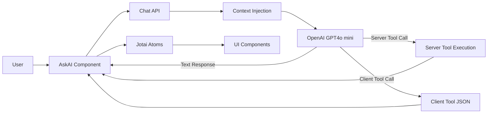
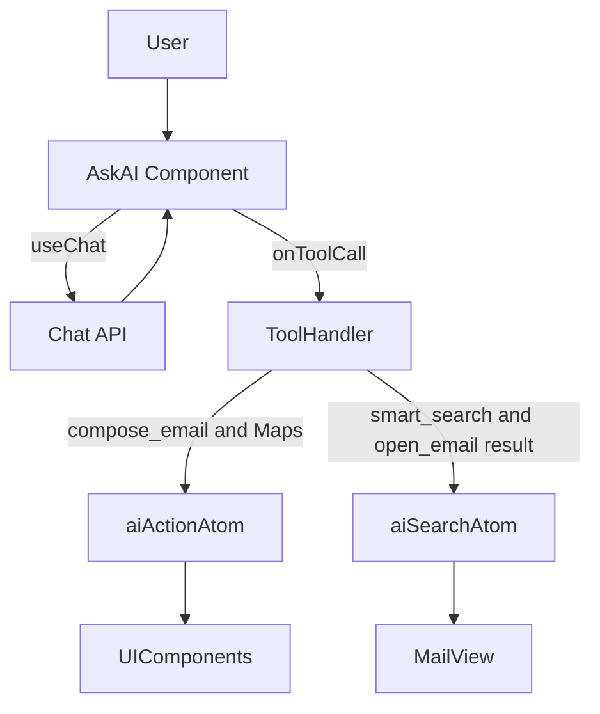
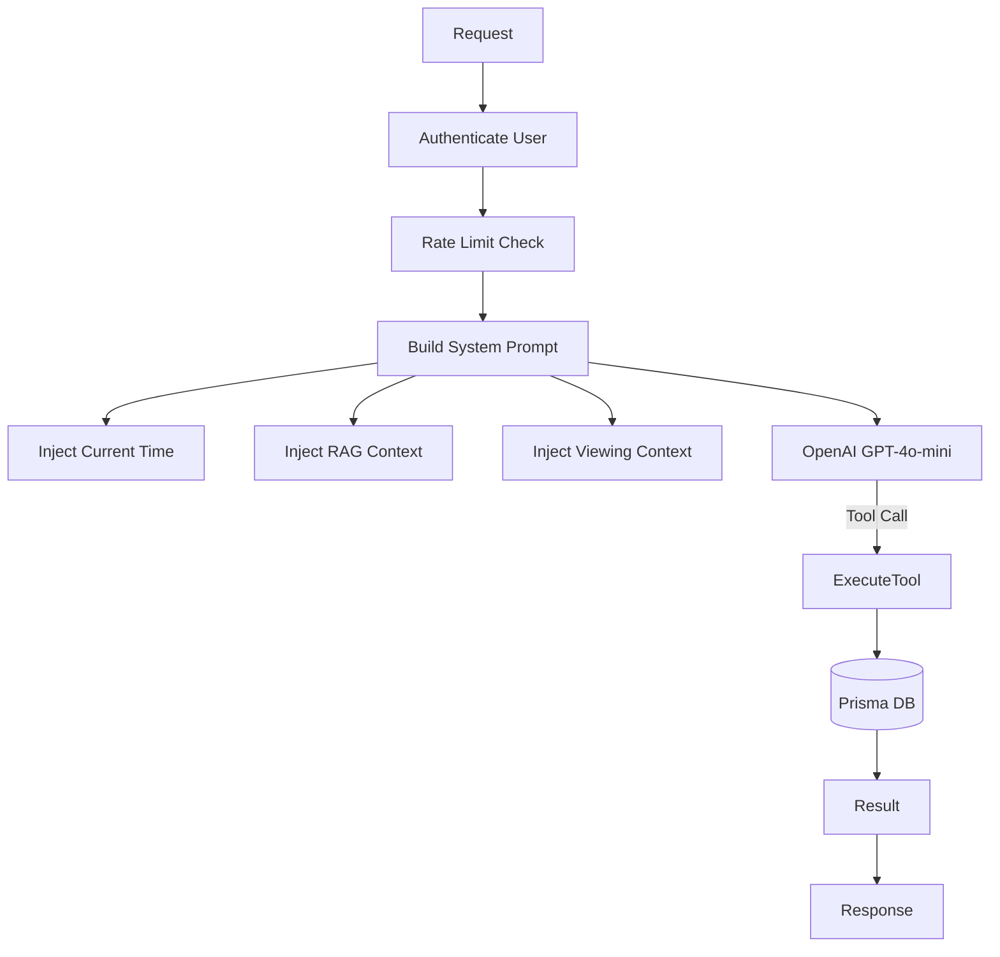
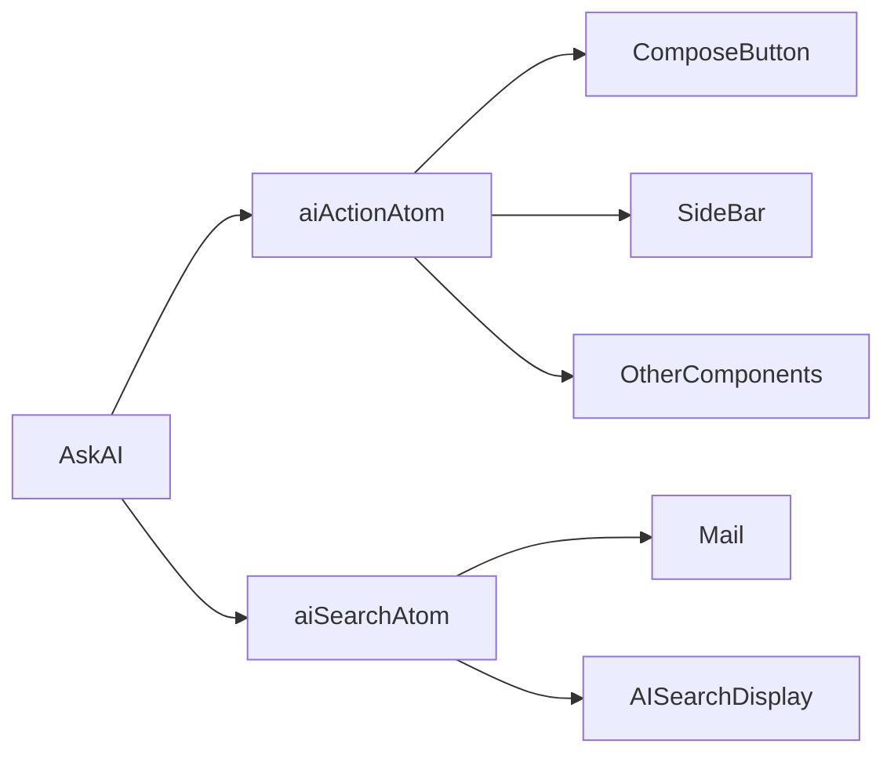
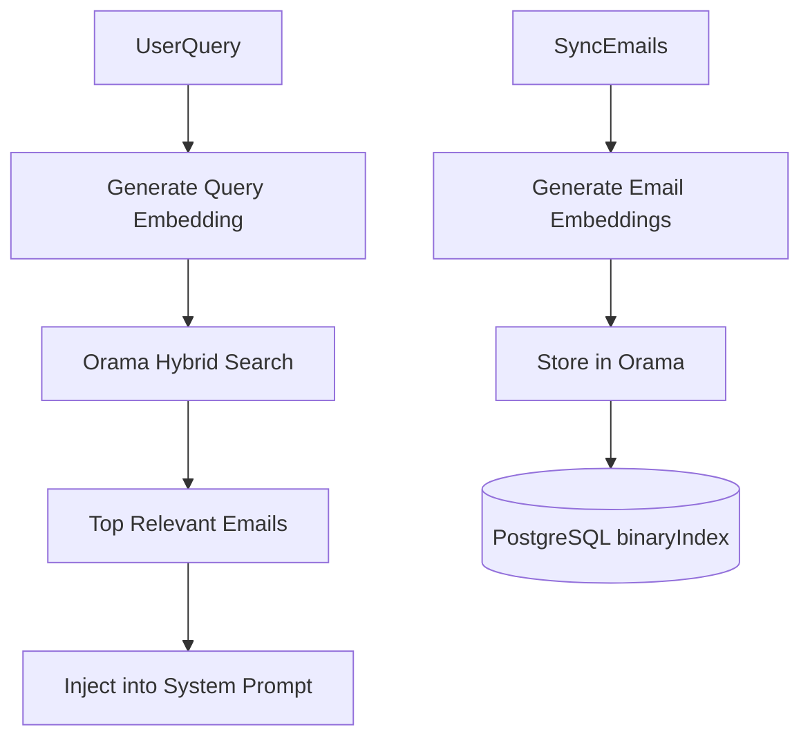

# AI Assistant Architecture

This document details the technical architecture of the AI Assistant in the **MailWebAI** application. The assistant is a full-stack feature integrating a Chat UI, server-side LLM processing with RAG (Retrieval-Augmented Generation), and client-side state management to control the application.

---

## High-Level Architecture

The AI Assistant operates on a **Client-Server-AI Loop**:



1. User Input: User types a command in the AskAI component.
2. Server-side Processing: The request is sent to /api/chat.
3. Context Injection: The server fetches RAG context and current viewing context and injects them into the System Prompt.
4. LLM Decision: OpenAI (GPT-4o-mini) decides to either answer textually or call a Tool.
5. Tool Execution:
   - Server-Side Tools executed immediately.
   - Client-Side Tools return structured JSON.
6. Client-Side Action: Dispatched to global state (Jotai).
7. UI Reaction: Components react instantly.

---

## Core Components

---

### 1. Frontend: AskAI Component



Location: src/app/mail/components/ask-ai.tsx

- Uses useChat (Vercel AI SDK)
- Uses useAIAction & useAISearch (Jotai atoms)
- Handles tool calls
- Dispatches client-side actions
- Displays feedback toasts
- Waits for server tool results when required

---

### 2. Backend: Chat API



Location: src/app/api/chat/route.ts

- Authenticates user
- Enforces 30 RPM rate limit
- Dynamically builds system prompt
- Injects Current Time, RAG Context, Viewing Context
- Defines tools using Zod schemas
- Executes server-side tools directly

---

### 3. State Management: Atoms



Location: src/app/mail/use-ai-action.ts

- aiActionAtom: Global event bus
- aiSearchAtom: Holds search query + threadIds
- Fully decoupled architecture

---

### 4. RAG Engine: Orama



Location: src/lib/orama.ts

- Vector DB: Orama
- Fields indexed: subject, body, from, to, sentAt
- Embeddings via text-embedding-3-small
- Hybrid search (vector + keyword)
- Injected into START CONTEXT BLOCK
- AI restricted to provided context

---

# Feature Deep Dives

---

## Feature Deep Dives

### 1. Compose & Send
**User Query:** *"Send an email to John about the meeting"*

1.  **LLM:** Decides to call `compose_email` with args: `{ to: ["john@example.com"], subject: "Meeting", body: "..." }`.
2.  **Client Dispatch:** `AskAI` receives this tool call and sets `aiActionAtom` to this object.
3.  **UI Reaction (`ComposeButton.tsx`):**
    * `ComposeButton` has a `useEffect` listening to `aiActionAtom`.
    * Detects `type: 'compose_email'`.
    * **Opens Drawer:** Sets `open(true)`.
    * **Auto-Fill:** It progressively fills the fields (`setToValues`, `setSubject`) with slight delays to create a "ghost-typing" visual effect, making the user see the AI working.
    * **Body Handling:** Passes the generated body to the `EmailEditor` component.

### 2. RAG & Search (Question Answering)
**User Query:** *"Find the email from Sarah about the project"*

1.  **LLM:** Calls `smart_search` tool with args: `{ from: "Sarah", keyword: "project" }`.
2.  **Server Execution:**
    * The `execute` function in `/api/chat` constructs a **Prisma Query**.
    * It filters by Sender (`from` OR `address` match) and Body/Subject content.
    * Returns a list of matching `threadIds` and metadata.
3.  **Client Update:**
    * The tool result (JSON) is streamed back to `AskAI`.
    * `AskAI` updates the `aiSearchAtom` with `{ query: "from: Sarah...", threadIds: [...] }`.
    * `AskAI` sets `threadId` to `null` to close any open email.
4.  **UI Render:**
    * `Mail` component sees `aiSearchAtom` is active.
    * Swaps the main view to `AISearchDisplay`, showing only the returned threads.

### 3. Navigate & Open
**User Query:** *"Open the latest email from David"*

1.  **LLM:** Calls `open_email` tool with args: `{ from: "David" }`.
2.  **Server Execution:**
    * Queries the DB for the most recent thread where the sender matches "David".
    * Returns `{ success: true, threadId: "thread_123" }`.
3.  **Client Update:**
    * `AskAI` receives the result.
    * Sets `threadId` to `"thread_123"`.
    * Clears `aiSearchAtom`.
4.  **UI Render:** The `Mail` component detects a `threadId` and renders the `ThreadDisplay` view seamlessly.

### 4. Context Awareness
**User Query:** *"Reply to this"*

1.  **Frontend:** When calling `/api/chat`, `AskAI` sends the current `threadId` (from the URL/state) in the request body.
2.  **Backend:**
    * `POST /api/chat` sees `threadId`.
    * Queries DB for that specific thread.
    * Adds a text block to the System Prompt:
        ```text
        CURRENTLY VIEWING EMAIL:
        - Subject: Project Update
        - From: Sarah <sarah@example.com>
        - Snippet: Hey, just wanted to let you know...
        ```
3.  **LLM:** Understands "this" refers to the email in the context.
4.  **Action:** Calls `compose_email` with `to: "sarah@example.com"`, `subject: "Re: Project Update"`, and generates a relevant reply body based on the snippet.

### 5. Filters via Assistant
**User Query:** *"Show only unread emails from this week"*

1.  **LLM:** Calls `smart_search` with `{ labels: ["unread"], dateFrom: "2023-10-01" }`.
2.  **Server:** Executes Prisma query filtering by `sysLabels` (for 'unread') and `lastMessageDate`.
3.  **Client:** Returns results.
4.  **Syncs UI State:** `AskAI` also calls `setMailFilter` (another global atom).
5.  **UI Reaction:** The `FilterBar` component listens to this atom and visually updates its buttons to show "Unread" and the date range as active filters, keeping the UI state in sync with the AI's actions.