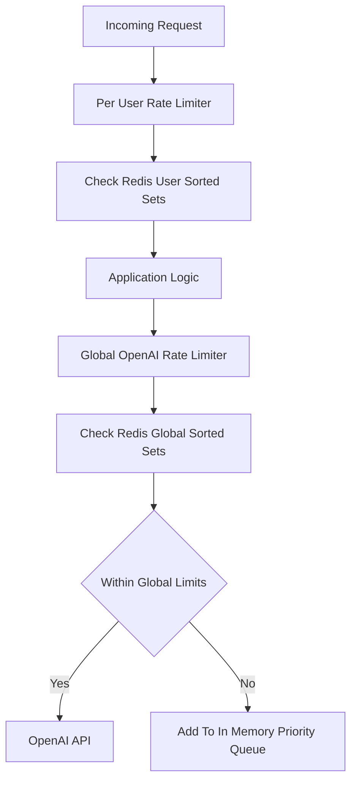
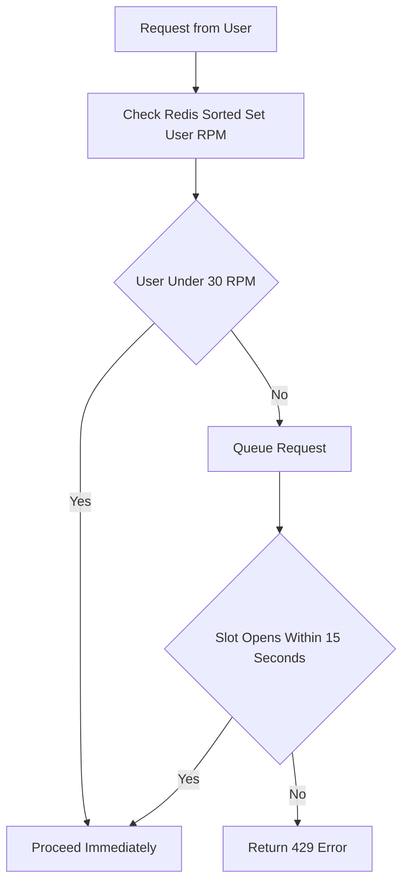
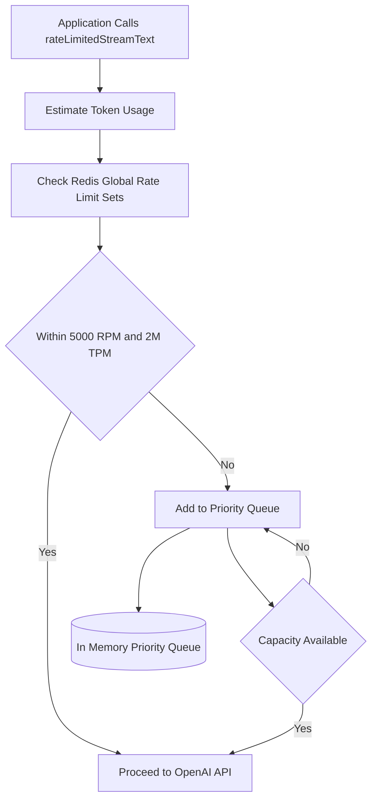
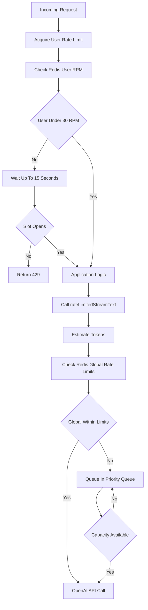

# API Rate Limiting Architecture

This document details the rate limiting architecture used in the MailWebAI application to ensure stability, prevent abuse, and manage OpenAI API costs/limits.

## Overview

The application employs a **Dual-Layer Rate Limiting Strategy**:

1.  **Per-User Rate Limiting:** Protects the application server from abuse by individual users.
2.  **Global OpenAI Rate Limiting:** Protects the OpenAI API quota and limits costs by managing the aggregate load from all users.

Both layers utilize **Redis (Upstash)** for distributed state management, ensuring limits are enforced across serverless function invocations. An **In-Memory fallback** is included for resilience if Redis is unavailable.



---

## 1. Per-User Rate Limiting (The "Outer Guard")

This layer runs first when a request hits an API endpoint. It ensures no single user can flood the system.

*   **Location:** `src/lib/user-rate-limiter.ts`
*   **Limit:** 30 Requests Per Minute (RPM) per user.
*   **Mechanism:** Queue-Based Sliding Window.
    *   When a request arrives, it checks the user's recent request timestamps in Redis.
    *   **If under limit:** Request proceeds immediately.
    *   **If over limit:** The request is **queued** (held in an async wait loop). It polls every 500ms to see if a slot has opened up in the sliding window.
    *   **Timeout:** If a slot doesn't open within **15 seconds**, the request is rejected with a `UserRateLimitError`.
*   **Storage:** Redis Sorted Sets (`user:rpm:{userId}`).
    *   **Score:** Timestamp (ms).
    *   **Member:** Unique Request ID.
    *   **TTL:** 120 seconds (auto-cleanup).



### Usage in Codebase

Used at the beginning of AI-heavy API routes:

*   **Chat:** `src/app/api/chat/route.ts`
*   **Completion:** `src/app/api/completion/route.ts`
*   **AI Search:** `src/app/api/ai-search/route.ts`

```typescript
// Example usage in API route
import { acquireUserRateLimit } from "@/lib/user-rate-limiter";

export async function POST(req: Request) {
  const { userId } = await auth();
  
  // This will wait or queue if user is sending too fast
  await acquireUserRateLimit(userId); 

  // Proceed with expensive logic...
}
```

---

## 2. Global OpenAI Rate Limiting (The "Inner Guard")

This layer wraps the actual calls to OpenAI. It ensures the application stays within the platform's TPM (Tokens Per Minute) and RPM limits.

*   **Location:** `src/lib/rate-limiter.ts` & `src/lib/openai-client.ts`
*   **Limits:** 
    *   **5,000 RPM** (Requests Per Minute)
    *   **2,000,000 TPM** (Tokens Per Minute)
*   **Mechanism:** Singleton Priority Queue with Token Estimation.
    *   Implemented as a Singleton (`OpenAIRateLimiter.getInstance()`).
    *   Requests are assigned a **Priority**:
        *   `high`: Interactive user chat.
        *   `normal`: Standard completions.
        *   `low`: Background tasks (e.g., embedding generation).
    *   Before making a call, the system estimates the token cost (User prompt + System prompt + History).
    *   If limits are exceeded, the request is queued internally in memory, waiting for a global slot.
*   **Storage:** Redis Sorted Sets.
    *   `ratelimit:openai:requests` (Global request timestamps)
    *   `ratelimit:openai:tokens` (Global token usage timestamps)



### Usage in Codebase

This is centralized in `src/lib/openai-client.ts`. We export custom wrappers that automatically enforce these limits.

*   **`rateLimitedStreamText`:** Replacement for Vercel AI SDK's `streamText`.
*   **`rateLimitedGetEmbeddings`:** Wrapper for embedding generation.

```typescript
// Example usage in src/lib/openai-client.ts
export async function rateLimitedStreamText(options, priority) {
  const limiter = OpenAIRateLimiter.getInstance();
  
  // Estimate tokens and wait for global capacity
  await limiter.acquire(priority, estimatedTokens);
  
  // Make actual OpenAI call
  return streamText(options);
}
```

---

## Summary Diagram logic

1.  **Incoming Request** (e.g., User sends chat message)
    ↓
2.  **`acquireUserRateLimit(userId)`**
    *   *Check:* Is User < 30 RPM?
    *   *Wait:* If NO, hold request for up to 15s.
    *   *Reject:* If timeout, return 429.
    ↓
3.  **Application Logic** (DB lookups, RAG, etc.)
    ↓
4.  **`rateLimitedStreamText()`**
    *   *Estimate:* Calculate expected token usage.
    *   *Check:* Is Global OpenAI < 5000 RPM & < 2M TPM?
    *   *Queue:* If NO, add to internal priority queue.
    ↓
5.  **OpenAI API Call** (Executed when global capacity allows)


