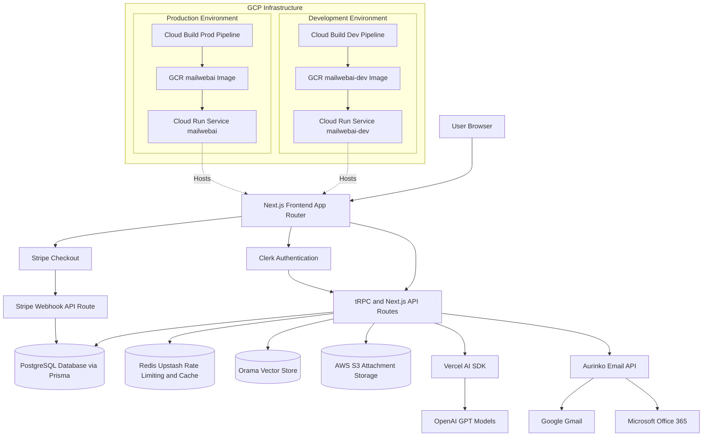

# MailWebAI Application Architecture

## 1. High-Level Overview

MailWebAI is a modern, AI-powered email client built on **Next.js**. It integrates with email providers (Google, Office 365) via valid OAuth flows managed by **Clerk** and **Aurinko**. The application leverages **OpenAI** for intelligence features (RAG, email summarization, auto-replies) and **Stripe** for subscription management.

The entire platform is containerized using **Docker** and deployed on **Google Cloud Platform (GCP)** using **Cloud Run**, ensuring scalability and a serverless operating model.

## 2. System Architecture Diagram

## 3. Technology Stack

### Frontend
- **Framework:** [Next.js 14](https://nextjs.org/) (App Router)
- **Language:** TypeScript
- **Styling:** 
  - **Tailwind CSS** for utility-first styling.
  - **Tailwind CSS Animate** for animation utilities.
- **UI Components:**
  - **Shadcn UI** (built on **Radix UI** primitives) for accessible, customizable components.
  - **Framer Motion** for complex animations.
  - **Sonner** for toast notifications.
  - **Lucide React** for icons.
- **State Management:** 
  - **Jotai** for atomic global state.
  - **TanStack Query (React Query)** for async state and data fetching.
- **Editor:** **Tiptap** / **Novel** for the rich text email editor.

### Backend (BFF - Backend for Frontend)
- **API Layer:** 
  - **tRPC (v11)** for end-to-end type-safe APIs between client and server.
  - **Next.js API Routes** for external webhooks (e.g., Stripe, Aurinko) and specific REST endpoints.
- **Database ORM:** **Prisma** for type-safe database access.
- **AI & ML:**
  - **Vercel AI SDK** for streaming AI responses.
  - **OpenAI** (GPT-4o / GPT-4-turbo) for core intelligence.
  - **Orama** for client-side vector search and RAG (Retrieval-Augmented Generation).
  - **LangChain** (concepts used for context window management).

### Database & Storage
- **Primary Database:** **PostgreSQL** (Managed).
- **Caching & Rate Limiting:** **Redis** (Upstash) used for:
  - API Rate Limiting.
  - User-specific request limits.
  - Caching ephemeral data.
- **Vector Storage:** **Orama** (In-memory/Persisted on Edge) for efficient vector search on emails.
- **Object Storage:** **AWS S3** (via SDK) for storing large email attachments.

## 4. Infrastructure & DevOps

The application is hosted fully on Google Cloud Platform (GCP).

### CI/CD Pipeline
- **Tool:** **Google Cloud Build**
- **Process:**
  1.  Triggered on git commits.
  2.  Builds a **Docker** container using the repository's `Dockerfile`.
  3.  Pushes the image to **Google Container Registry (GCR)** (`gcr.io/mailwebai/...`).
  4.  Deploys the new image to **Google Cloud Run**.

### Environments
The project is configured with two distinct environments, each with its own build pipeline and deployment service:

1.  **Development Environment**
    -   **Config File:** `cloudbuild-dev.yaml`
    -   **Service Name:** `mailwebai-dev` (Cloud Run)
    -   **Registry:** `gcr.io/mailwebai/mailwebai-dev`
    -   **Purpose:** Rapid iteration, testing new features.

2.  **Production Environment**
    -   **Config File:** `cloudbuild.yaml`
    -   **Service Name:** `mailwebai` (Cloud Run)
    -   **Registry:** `gcr.io/mailwebai/mailwebai`
    -   **Purpose:** Stable, user-facing application.

## 5. External Services & Integrations

### Authentication
-   **Provider:** **Clerk**
-   **Role:** Handles user sign-up, sign-in, and session management.
-   **Integration:** Middleware protects routes; user IDs are mapped to the local database `User` model.

### Email Engine
-   **Provider:** **Aurinko** (Primary)
-   **Role:** 
    -   Acts as the unified API layer for Gmail and Office 365.
    -   Handles OAuth token exchange and refresh.
    -   Provides webhooks for real-time email syncing (`account.ts`).
    -   Note: **Nylas** references exist in the codebase but Aurinko is currently the active driver for account synchronization and sending.

### Payments
-   **Provider:** **Stripe**
-   **Role:** Handles subscription billing (Pro vs. Free tiers).
-   **Webhooks:** Listens for subscription events to update access rights in the local database.

## 6. Key Architecture Patterns

-   **RAG (Retrieval-Augmented Generation):**
    When a user asks a question, the system searches the local Orama vector index for relevant emails, retrieves them, and feeds them as context to the OpenAI model to generate an accurate answer.

-   **Email Synchronization:**
    A sophisticated sync engine (`sync-to-db.ts`) runs partially via webhooks and partially via user-triggered actions to keep the local Postgres database in sync with the remote email provider. It handles "Delta Tokens" to efficiently fetch only new changes.

-   **Type Safety:**
    End-to-end type safety is guaranteed from the database (Prisma) to the backend (tRPC) to the frontend (React), minimizing runtime errors.
