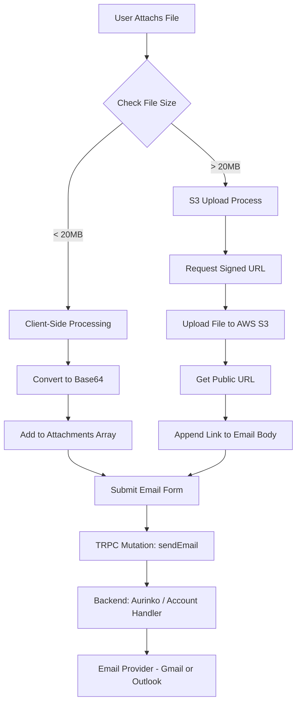

# Email Sending & Attachment Architecture

This document outlines the architecture for sending emails, specifically focusing on how attachments are processed based on their file size.

## Architecture Overview

The email sending process handles attachments dynamically to ensure efficient delivery and compliance with provider limits.

### Attachment Handling Logic

1.  **Small Files (< 20MB)**:
    *   Files are read client-side.
    *   Converted to **Base64** strings.
    *   Sent directly as part of the API payload in the `attachments` array.
    *   **Limit**: The total size of all small attachments must not exceed 20MB.

2.  **Large Files (> 20MB)**:
    *   Files are identified as "large" immediately upon selection.
    *   **Uploaded to AWS S3** via a signed URL.
    *   Once uploaded, a public link to the file is generated.
    *   This link is appended to the email **body** (HTML).
    *   The file is *not* sent as a standard MIME attachment, but as a downloadable link.

## Process Flow Diagram

## Technical Implementation Details

### Frontend (`ComposeButton`)
- **File Selection**: Separates files into `smallFiles` and `largeFiles`.
- **Large Files**: Triggers `uploadToS3` (utilizing `/api/upload` for presigned URLs).
- **Small Files**: Uses `FileReader` to generate Base64 strings.
- **Validation**: Prevents submission if small attachments total > 20MB.

### Backend (`mailRouter`)
- Receives the email payload.
- `attachments` array contains only the Base64 content of small files.
- Large files are already part of the `body` string as HTML links (e.g., `<a href="...">filename</a>`).
- Forwards the payload to the `Account` class which interfaces with the Aurinko API.

### Storage
- **AWS S3**: Used for storing large files.
- **Retention**: (Note: specific retention policies should be configured on the S3 bucket).
