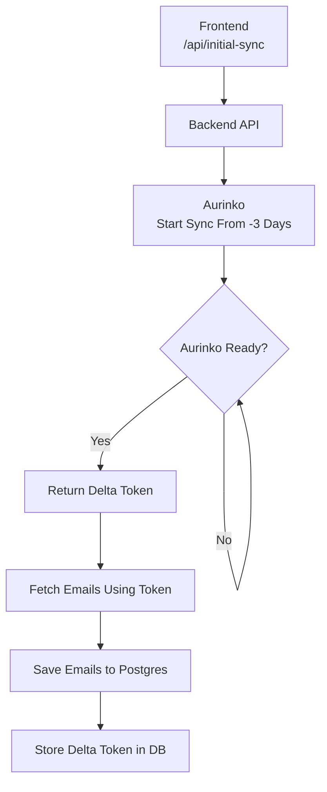
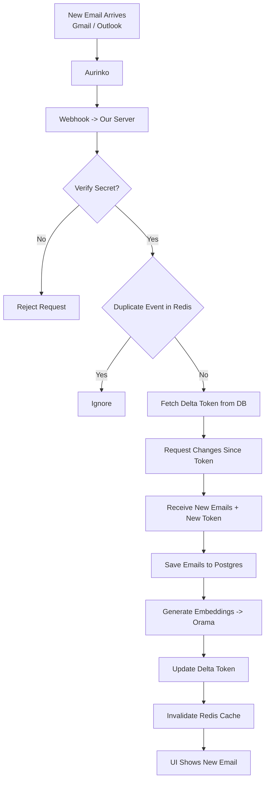
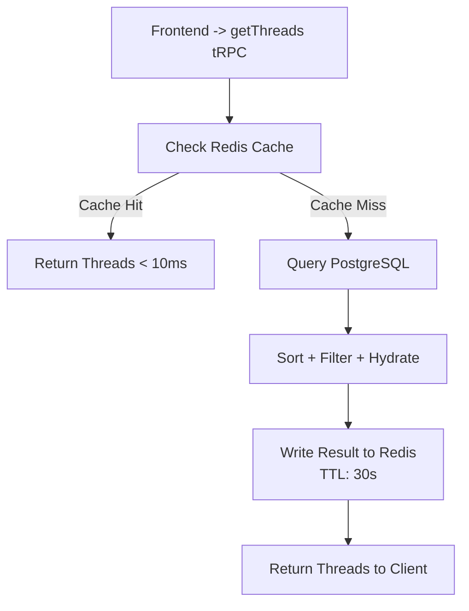
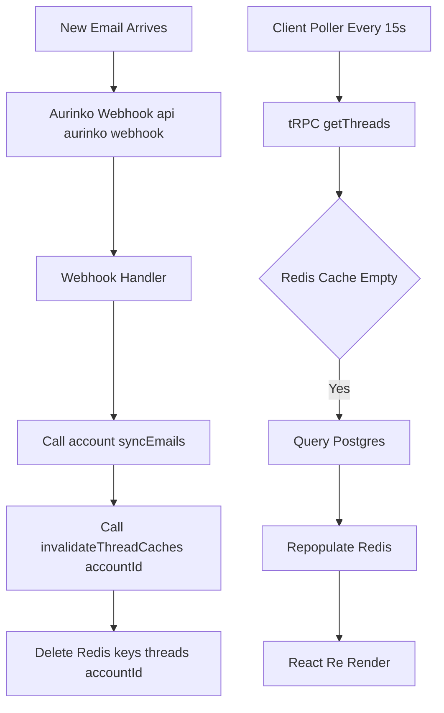

# Email Sync: How It Works

This guide explains the email synchronization process in simple terms for two scenarios: when a user first connects their account, and when they receive new emails later.

---

# 1. A New User (Initial Sync)

When a user links their email account (Gmail or Outlook) to our app for the first time, we perform an "Initial Sync". This is like downloading a snapshot of their recent history.

**Goal:** Fetch the last 3 days of emails so the user sees data immediately.

## Flow Diagram



## Step-by-Step

1. **Start the Job**
   - Frontend calls `/api/initial-sync`
   - Backend requests Aurinko to prepare emails from 3 days ago

2. **Wait for Readiness**
   - Aurinko processes in background
   - Backend polls until ready
   - Aurinko returns a **Delta Token**
   - Delta Token acts as a bookmark

3. **Download Emails**
   - Fetch emails using the token
   - Store them in PostgreSQL

4. **Save Bookmark**
   - Store Delta Token in database
   - Future syncs use this token

---

# 2. Existing User (Real-Time Sync via Webhooks)

After initial sync, updates are handled incrementally using webhooks.

**Goal:** Instantly process new emails.

## Flow Diagram



## Step-by-Step

1. **Webhook Trigger**
   - Aurinko sends event when new email arrives

2. **Security & Dedup**
   - Validate webhook signature
   - Use Redis to ignore duplicate events

3. **Fetch Incremental Changes**
   - Retrieve stored Delta Token
   - Request only changes since that token
   - Receive updated emails + new Delta Token

4. **Persist Updates**
   - Save new emails in PostgreSQL
   - Generate embeddings (Orama vector DB)
   - Update Delta Token

5. **Refresh UI**
   - Invalidate Redis cache
   - User sees updated inbox

---

# 3. Displaying Emails (Cache-First Strategy)

The app uses a Cache-First / Stale-While-Revalidate approach.

## Flow Diagram



## Flow Explanation

1. **Cache Check**
   - Redis key: `threads:{accountId}:{tab}:{done}`
   - If found → return instantly (<10ms)

2. **Database Fallback**
   - Query PostgreSQL
   - Apply filters (inbox/sent/draft)
   - Sort by latest message date

3. **Cache Repopulation**
   - Store result in Redis (TTL: 30s)
   - Prevents thundering herd issue

---

## 4. Real-Time Synchronization (Technical Implementation)

The system achieves "real-time" updates without WebSockets by combining **optimistic UI updates** with **Server-Side Cache Invalidation** and **Short-Interval Polling**.



### Component: `useThreads` Hook (`src/app/mail/use-threads.tsx`)

```typescript
const { data: threads } = api.mail.getThreads.useQuery(
    queryInput,
    { 
        refetchInterval: 15000, // Polling frequency: 15 seconds
        placeholderData: (e) => e 
    }
)
```

### The Invalidation Cycle (Data Flow)

1.  **Event Trigger**: A new email arrives via **Aurinko Webhook** (`api/aurinko/webhook`).
2.  **Invalidation Logic**:
    *   The webhook handler calls `account.syncEmails()`.
    *   Upon success, it executes `invalidateThreadCaches(accountId)` (`src/lib/email-cache.ts`).
    *   **Action**: Executing `DEL threads:{accountId}:*` removes *all* cached thread lists for that user.
3.  **Client Re-fetch**:
    *   The browser's background poller (`tanstack-query`) fires every 15s.
    *   **Next Poll**:
        *   The tRPC procedure runs.
        *   Redis Cache is now **empty** (due to step 2).
        *   The system forces a fresh DB read, picking up the new email.
        *   Redis is re-populated with the new list.
    *   **UI Update**: The React component re-renders with the new thread.


